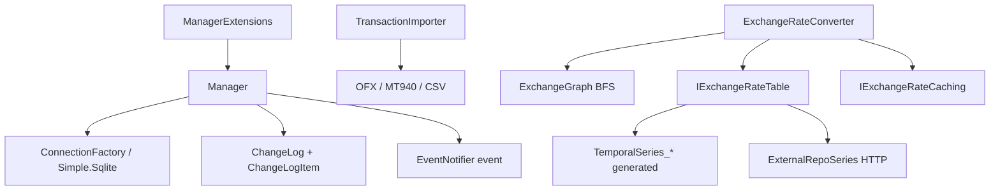

# AGENTS.md — SimpleFinance

Guidance for AI agents reading in this repository and using this library.

## What this is

`Simple.Finance` is a small personal-finance manager **library** (NuGet: `Simple.Finance`),
backed by SQLite through `Simple.Sqlite`. Everything is a plain CRUD-over-SQLite
`Manager` class plus helpers for currency conversion and bank-file import.
There is no service layer, no DI container, no async data access.

## Solution layout

| Project | TFM | Role |
| --- | --- | --- |
| `Simple.Finance/` | `netstandard2.1`, LangVersion 12, nullable enabled | The library. **Everything of value lives here.** |
| `UnitTests/` | `net9.0` | xUnit v3 automated tests. The real test suite. |
| `Tests/` | `net9.0` | Console sandbox — `SampleFunctions.cs` is a manual smoke run, `Ignore.cs` is scratch space for new ideas and one-off scraping. Not a test suite. |
| `DemoProject/` | `net9.0-windows`, WinForms | Demo GUI app (`AssemblyName` = `MyPersonalFinances`). |
| `WebApi/` | `net9.0`, ASP.NET Core | Web API over the library (`AssemblyName` = `Simple.Finance.WebApi`). Serilog + Swashbuckle, everything local under `[app]/data`. |
| `Assets/` | — | `TemporalSeries_*.json` rate series, served over HTTP from `main` and consumed by `ExternalRepoSeries`. |
| `SampleFiles/` | — | Sample bank/fiscal files (OFX, OFC, CNAB, MT940, SPED, NFe, IFF, PDF statements). |

External packages the library depends on: `Simple.Sqlite`, `Simple.API`, `RafaelEstevam.TextSerializer`.

## Commands

```
dotnet build                                # whole solution
dotnet test                                 # runs UnitTests
dotnet test UnitTests/UnitTests.csproj
dotnet run --project Tests                  # console smoke run against ./data.db
```

CI (`.github/workflows/dotnet.yml`): `windows-latest`, .NET 9, restore → build → test on push/PR to `main`.
Release (`.github/workflows/release.yml`): tag `v*.*.*` → publishes `DemoProject` as a self-contained
single-file `win-x64` zip and creates a GitHub Release. NuGet version is `<Version>` in `Simple.Finance.csproj`.

## Architecture



### Tables (`Simple.Finance/Tables/`)

`record` types with `Simple.DatabaseWrapper.Attributes` (`[PrimaryKey]`, `[Index]`).
Schema is created/migrated by `Manager.Initialize()` via `cnn.CreateTables().Add<T>()…Commit()`.

- `Wallet` — `Id, Name, Description, BaseCurrency, IsDeleted`
- `Category` — `Id, IsExpense, Name, Description, MonthlyBudget, IsDeleted`; `MonthlyBudget` is a
  spending limit, not money — it stays positive on expense categories and `0` means none. Nothing
  in the library reads it: it is stored, validated as non-negative, and handed back.
- `Person` — counterparty; `Id, Name, IsDeleted`
- `Transac` — the transaction record.
- `ChangeLog` / `ChangeLogItem` — audit trail; `TableLogRegistry` is the flattened join projection.
- `Scenario` / `ScenarioItem` — planning drafts, never money. See *Scenarios*.

### Manager

One class, region-separated: Wallets / Categories / Persons / Transactions / Scenarios / ChangeLog / Notification / Search Enums.

- Connection-per-call: every method does `using var cnn = db.GetConnection();`. No shared connection, no transactions
  spanning methods. `CreateUpdateBulkTransaction` is the only batching path (one connection, notifications fired
  after the connection closes).
- `Manager(string dbFile)` for file-backed; `Manager.FromDatabase(ConnectionFactory)` for an external database
  (backup is then unsupported — `Initialize(createBackup: true)` throws).
- `Initialize(createBackup, backupName)` gzips the current db file to `backupName + ".gz"` before migrating.
- `protected virtual InternalInitialize(ISqliteConnection)` is the extension point for derived classes
  (README pitches subclassing for users/auth).

### Invariants enforced in `createUpdateTransaction` — do not weaken

1. `DueValue != 0`, else `InvalidOperationException`.
2. Sign is **forced** from the category: `IsExpense` → negative, else positive; applied to
   `DueValue`, `PaidValue`, `RC_DueValue`, `RC_PaidValue`.
3. `WalletId` must resolve; `CategoryId`/`CounterpartyId` must resolve when non-zero. `CategoryId == 0` is
   refused earlier, by `CreateUpdateTransaction`/`CreateUpdateBulkTransaction` — not here, because
   `CreateWalletTransfer` writes both legs through this function and a transfer carries no category.
4. `PaymentCurrency` is upper-cased and, when both sides are non-empty, must equal `Wallet.BaseCurrency`.
5. `Type == WalletTransfer` throws here — transfers have their own API. `Special` is `NotImplementedException`.
6. `Changed` always set to `UtcNow`; `Created` preserved from the original row on update.
7. `Category.IsExpense` cannot change after creation (`CreateUpdateCategory` throws).
8. `Description` must not be `NullOrEmpty` — this reaches transfers too, since `CreateWalletTransfer`
   writes both legs through this function. `TransactionImporter.FromOFX` already falls back to `"[?]"`,
   but `FromMT940` passes `ReferenceForOwner` straight through, so a statement without that field
   throws on save rather than on parse.

### Required text

`requireText` rejects `NullOrEmpty` on `Name` for `Wallet`, `Category`, `Person`, `Scenario` and
`ScenarioItem`, on create and update; whitespace-only passes. `Description` on those records stays free
text — `Transac.Description` is required by invariant 8 instead, since a transaction has no `Name`.
Messages are qualified (`'Wallet.Name'`) because five tables carry a `Name`.
`Category.MonthlyBudget` is validated in the same place and must not be negative.

### Transfers

`CreateWalletTransfer(...)` writes **two** `Transac` rows (negative on source wallet, positive on destination),
then `UPDATE`s both to `Type = WalletTransfer` with `TypeOtherId` cross-linking them, then logs both.
Source category must be `IsExpense`, destination must not. Update the pair via `UpdateWalletTransfer` /
`ManagerExtensions.GetTransferPair` — never through `CreateUpdateTransaction`.

### ChangeLog + notifications

`saveChangeLog<T>(cnn, older, newer, notify)` diffs writable properties via `ModelHelpers.ModelDiff`
and bulk-inserts one `ChangeLogItem` per changed field. The diff compares the **rendered text**, so that
rendering is culture-independent by design: null → `"[NL]"`, `decimal` rounded to 10 places without
trailing zeros, `DateTime` as `yyyy-MM-dd HH:mm:ss` (**seconds, milliseconds are dropped on purpose**),
anything else `IFormattable` on the invariant culture. Rendering a value differently on two machines, or
for two scales of the same amount, would log changes that never happened.
`older == null` ⇒ notification action `New`, else `Update`.

`getTableName(Type)` = last segment of `Type.FullName`; that string lands in `ChangeLog.TableName` and is
re-mapped to a notification item by the static `notificationItems` dictionary, itself keyed off the same
function — so a table rename carries the routing with it.

`EventLogCurrentExternalId` is stamped into every `ChangeLog.ExternalId` — the hook for "which user did this".
One event has one author, so `ChangeLogItem` does not repeat it; queries filter `cl.ExternalId` and
`TableLogRegistry` flattens it into each joined row for consumers.

### Scenarios (planning)

`Scenario` (`Name`, nullable `Description`, `IsActive`) plus `ScenarioItem` (`ScenarioId`, `WalletId`, `CategoryId`,
`Date`, `Value`, `Name`, `IsEnabled`, nullable `ExternalIdentifier`). An item is a **hypothetical `Transac`**: one
wallet, one date, one value. There is no recurrence type — a parcelling is N items, the same materialisation
doctrine used for transactions.

- **Drafts, not money.** They are the only records with a real `DELETE` (`DeleteScenario` also drops its items,
  `DeleteScenarioItem` drops one), and the only writes that produce **no `ChangeLog` and no notification**:
  an audit trail of what-ifs would bury the trail of what happened.
- **Same invariants as a transaction**, because they will be compared against real rows: wallet must resolve,
  category must resolve when non-zero, `Value != 0`, `Name` must not be empty, and the **category forces
  the sign** (`CategoryId == 0` keeps the caller's — a draft may stay uncategorised, a transaction may
  not). Currency is never stored — it is the wallet's
  `BaseCurrency`, as with `Transac`.
- **`IsActive` composes, it does not exclude.** Two active scenarios are projected together; comparing A against B
  is running the projection twice, never a flag. It is persisted so the selection survives a restart.
- `CreateUpdateBulkScenarioItem` loads the referenced scenarios, wallets and categories **once each** into
  dictionaries and then applies the rule per item — 3 reads, not 3 per item. Like the transaction bulk it is not
  transactional: an invalid item throws and the previous ones stay.
- `ProjectScenariosItems(start, end, isActive)` reads every wallet on a window, `ProjectScenariosItemsFor(walletId)`
  reads one wallet with no window. Both are ordered by `Date` then `Id`, so equal dates never reshuffle.
  "Active" means scenario active **and** item enabled; `false` is the exact complement, `null` takes everything.

### Exchange rates (`ExchangeRate/`)

- `IExchangeRateTable`: `Initialize()`, `GetRateFor(base, quote, date)`, `AvailableCurrencyPairs()`.
- `ExchangeGraph` builds a currency graph from all pairs (each pair adds both directions, the reverse marked
  `Inverted`) and BFS-routes `start → target` — so the route has the fewest hops, and the first table that
  declared a pair owns that hop. Hop nodes keep the *declared* `BaseCur`/`QuoteCur` orientation; only
  `Inverted` says which way it is crossed. Currency codes are compared `OrdinalIgnoreCase` throughout
  (`graphTable`, `visited`, `parent` — all three must stay in sync, or path reconstruction throws).
- `ExchangeRateConverter.GetRateFor` walks the route, multiplying rates (inverting where flagged), falling back
  to other tables per hop when the graph's table has no data for that date; the fallback re-queries in
  `ExchangeRateTables` order, always in the declared orientation, and stops at the first answer.
  Any missing hop ⇒ `null`, and `null` is never memoised. A hop rate of `0` is *not* inverted (guard against
  division by zero), so the crossing yields `0`.
  Results memoised per `base/quote#yyyyMMdd` via `IExchangeRateCaching` (`ExchangeRateMemoryCache` default,
  never evicts) — endpoints only, never the intermediate hops; the key is case-sensitive and day-granular.
  `InitializeTables()` must run before use: it is what (re)builds the graph, so tables added afterwards stay
  invisible until it runs again.
- `TemporalSeries_*.cs` are **generated data files** (up to 162 KB each) — `decimal[][][]` indexed
  `[year - firstYear][month - 1][day - 1]`, read by `ExchangeRateConverter.getTableValue`. Do not hand-edit;
  regenerate with the scrapers in `Tests/Ignore.cs`. `TemporalSeries_BTCUSD` also derives `SAT` (`BTC / 1e8`).
- `ExternalRepoSeries` fetches `Assets/TemporalSeries_*.json` from `raw.githubusercontent.com/.../main/Assets/`
  via a `Simple.API` client interface. **Network-dependent — never put it in a unit test.**
  Its file list is hard-coded in `IExternalSeries`; adding an asset means adding a method there too.

### Importers (`Importers/`)

`TransactionImporter` is the only entry point that produces `Transac`: `FromOFX` (path or `OfxFile`),
`FromMT940` (`"D"` ⇒ negative), `FromCSV(path, Func<string[], Transac>, delimiter)`.
`FromOFX` and `FromMT940` take **two** default categories, `(walletId, defaultIncomeCategoryId,
defaultExpenseCategoryId)`, and pick between them by the sign the bank gave the row. A statement runs
both ways, and `createUpdateTransaction` forces the sign from the category, so one category for the
whole file would invert half of it; two categories keep every row on the side it arrived on. Pass `0`
for either to leave those rows uncategorised, and then the caller has to categorise them before saving:
`CreateUpdateTransaction` refuses `CategoryId == 0`.
Imported rows are `Status = Paid`, `Type = Simple`, both dates set to the posted date; OFX keeps `FitId`
in `ExternalIdentifier`. Nothing deduplicates on `ExternalIdentifier` — callers must.

- `OFX/` — `OfxFile` XML deserializer (`FromFile`, `FromFile_Encoding1252`, `FromXML`) + `OfxWriter`.
- `MT940/` — `MT940Parser` / `MT940Statement`, rule-driven field splitting via `MTHelper`.
- `CNAB/` — fixed-width CNAB240/CNAB400 record models declared with `TextSerializer` attributes
  (`[RegistrySize]`, `[Index]`, `[Type]`, `[Length]`). Field names and Portuguese comments follow the bank specs;
  keep them.

### Helpers

`DateHelpers` (Start/EndOf Year|Month|Day|Hour|Minute, `MinOf`/`MaxOf`), `CurrencyHelpers`
(system currencies from `CultureInfo` + custom `BTC`/`SAT` formats, `decimal?.FormatFor(code)`),
`ModelHelpers.ModelDiff`.

## WebApi (`WebApi/`)

ASP.NET Core service over the library. Deliberately exposes only the direct features: **no** currency
conversion, **no** export, **no** `EventNotifier`. Statement *import* is exposed, but read-only:
it parses and answers, it never writes.

Everything it writes lives under the application folder, composed by `AppPaths`:
`data/db.sqlite` (management), `data/log/LogyyyyMMdd.log` (Serilog, file sink only),
`data/users/db_{accountKey}.sqlite` (one finance database per account),
`data/users/bkp/{accountKey}/{yyyyMMdd}.gz`.

- **Accounts** (`AccountManagement/`) — `Account` (Guid `Key` as `[PrimaryKey]`) and `AccountPreference`
  live in the management database. Creating an account *is* creating a Key; it is returned once and
  cannot be recovered, and whoever holds it owns that finance database.
- **Authentication** (`Auth/`) — `ApiKeyAuthenticationHandler` reads the Key from the header named by
  `ApiKeyDefaults.HeaderName`. The authorization `FallbackPolicy` requires an authenticated user, so the
  service fails closed: only `[AllowAnonymous]` (`/api/hello`, `POST /api/account`, `/` redirect) is open.
- **`ManagerCache`** — one `Manager` per account in `IMemoryCache`, 30 min sliding. Entering the cache is
  what runs `Initialize`, and it takes the daily backup — first session of the day wins, later ones skip so
  a damaged database cannot overwrite the good copy. A lock guards **creation only**, never usage.
- **Controllers** — everything account-scoped derives from `AccountControllerBase`, which turns the Key
  into `Manager`. Wallets, Categories, Persons, Transactions, Transfers, ChangeLog, Import, plus account
  preferences.
- **Two transaction searches, one shaping** — `TransactionsController.Search` (`GET /api/transactions`)
  keeps the window and the single `kind`/`kindId` cut; `SearchBy` (`GET /api/transactions/by`, a
  literal segment that cannot collide with the `{id:long}` read) binds `TransactionSearchRequest`
  from the query and passes the three optional ids to the `Manager` overload that composes them —
  `AND`, and `0` selects the rows carrying none. `order`/`limit` mean the same thing on both, so both
  call `TransactionSearchRequest.Rejection`/`Shape`: the sort is by the very date `dateType` chose,
  with `Id` breaking ties so a `limit` is reproducible.
- **Import** (`ImportController`) — `TransactionImporter` over an upload: `POST /api/import/{ofx|mt940}`
  takes `multipart/form-data` (512 KB cap) and answers `TransactionRequest[]`, the same shape
  `POST /api/transactions` accepts, so a parsed row goes back untouched. Nothing is persisted and nothing
  is deduplicated. The importer picks the category by the sign the bank gave the row —
  `DefaultIncomeCategoryId` for positive, `DefaultExpenseCategoryId` for negative — so the controller
  checks that `WalletId` resolves, that each category exists when non-zero, and that each one sits on its
  own side of `IsExpense`: a swapped pair would land on exactly the rows whose sign `Manager` then flips.
  The import never reaches the `Manager`, so without those checks the client would only learn the ids are
  wrong one POST later. It parses from text, not from disk (`OfxFile.FromXML` / `MT940Parser.FromLines`) —
  no temp file — and decodes the upload as UTF-8 falling back to `Latin1`, since bank files are commonly
  Windows-1252. CSV is deliberately absent: `TransactionImporter.FromCSV` needs a
  `Func<string[], Transac>` per layout, which is a client concern.
- **ChangeLog** — read only, it is written by the library itself. The flat join `TableLogRegistry` is folded
  into one entry per event, and `OldValue`/`NewValue` are served exactly as stored, sentinel `[NL]` included:
  rewriting an audit trail on the way out would make the API disagree with the database.
- **`DomainExceptionFilter`** — the library validates by throwing; `ArgumentException` and
  `InvalidOperationException` become `400 ProblemDetails`, `NotImplementedException` becomes `501`.
  Anything else stays a 500.
- **JSON** — `DataConverters/UtcDateTimeConverter` forces every date onto the wire as explicit UTC
  (SQLite hands them back as `Unspecified`); enums travel as names.
- Namespaces inside `Simple.Finance.WebApi` must never shadow the library's (`Tables`, `Models`,
  `Helpers`): the compiler would bind the nearest one and silently pick the wrong type.

`WebApi/AGENTS.md` exists: guidance for agents **using** the API to run someone's finances
(auth, the three balance endpoints, credit cards, recipes, traps). Read it before touching endpoint
semantics; it is not repeated here.

## Code conventions

Match the existing style exactly; it is consistent and deliberate.

- File-scoped `namespace X;` **first**, `using` directives **inside/after** the namespace declaration.
- `ImplicitUsings` is **disabled** in `Simple.Finance` — every `using` is explicit.
- Public members `PascalCase`; private/protected members and locals `camelCase`
  (`saveChangeLog`, `getTableName`, `compress`, `updateWalletTransfer`).
- Data types are `record`s with `{ get; set; }` and `= string.Empty;` defaults; `Nullable` is enabled — honor it.
- SQL is inline, parameterised with anonymous objects, and uses `nameof(...)` for table/column names where practical.
- Collection expressions (`[]`, `[…]`) and C# 12 primary constructors are used; target framework is
  `netstandard2.1`, so **no** .NET-only BCL APIs.
- Validation throws `InvalidOperationException` / `ArgumentException` with a message naming the offending field.

## Deliberate design

These are choices, not defects. Work with them; changing any of them is a product decision, not a cleanup.

- **`Manager` is synchronous, single-connection-per-call and not thread-safe.** Don't sprinkle `async`,
  don't add locking or a shared connection.
- **Deprecation is a slow ladder.** They become `error: true` after many revisions, and are only
  removed long after that. Don't call them from new code and don't accelerate the ladder.
- **`Tests/Ignore.cs` is a sandbox** for new ideas and one-off data scraping. Don't lint it, refactor it, test it, or take its warnings seriously.
- **`IsDeleted` is a soft flag with no delete API.** Nothing in `Manager` filters on it; presentation decides.

## Landmines

- `TemporalSeries_*.cs` are generated; hand-editing them desyncs the `Assets/*.json` served to
  `ExternalRepoSeries` and moves the pinned rates in `UnitTests`.

## Testing expectations

- Folders mirror the subject: `ManagerTests/` (core CRUD, validation, transfers, change log, notifications),
  `ExchangeTableTests/`, `HelperTests/`. xUnit v3, `[Fact]`/`[Theory]` + `[InlineData]`.
- **Test classes must be `public`** — xUnit does not discover `internal` ones.
- `ManagerTests/ManagerTestBase.cs` gives each test its own temp SQLite file plus `newWallet`/`newCategory`/
  `newPerson`/`tx`/`newTx` builders and a `past` date constant. Inherit it instead of hand-rolling a database.
- Timezone matters: `GetWalletBalance` compares against SQLite `CURRENT_TIMESTAMP` (UTC). Use the `past`
  constant for "already settled" rows and `DateTime.UtcNow.AddDays(n)` for future ones — never `DateTime.Now`.
- Existing exchange tests pin exact rates at `2020-12-31` with `precision: 6|10` — regenerating a
  `TemporalSeries_*` file will move those numbers. Update expectations deliberately, not blindly.
- Tests must be offline and deterministic: use `ExchangeRateConverter.CreateWithTemporalSeries()`, never
  `ExternalRepoSeries`.
- Routing/crossing mechanics are tested against `ExchangeTableTests/FakeRateTable.cs`, not the generated
  series: `Pair` (declared + served), `Declare` (visible to the graph, no data — drives the per-hop fallback),
  `Serve`/`ServeOn` (data without a graph edge), plus `Queries`/`InitializeCalls` and a `SpyRateCache`
  recording cache hits. Prefer it over `CreateWithTemporalSeries()` whenever the assertion is about the graph.
- `dotnet run --project Tests` is the manual smoke test; it writes `data.db` in the working directory.

## Unread areas

- `SampleFiles/` contents not to be inspected
- Bulk generated rate data in `ExchangeRate/ExchangeTables/TemporalSeries_*.cs` was sampled, not read in full.
