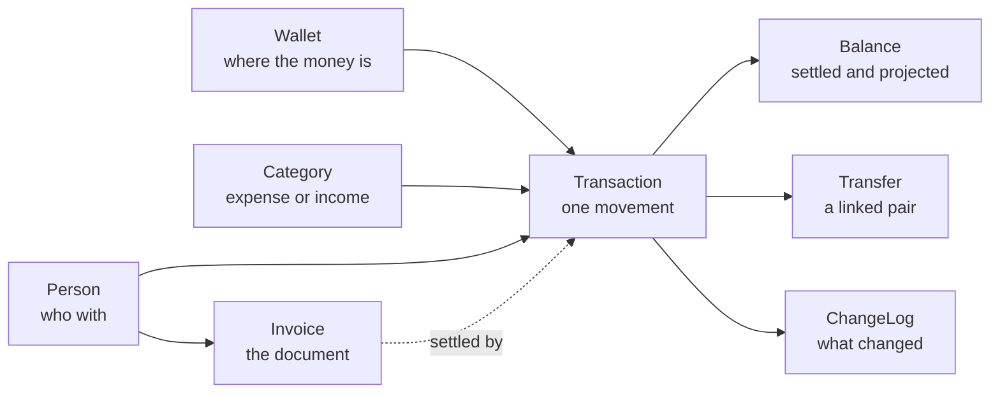

# AGENTS.md — Simple.Finance WebApi

Guidance for AI agents **using this API** to run someone's personal finances on their behalf.
For how the service is built, see the repository root `AGENTS.md`.

You are handling real money records for one person. Nothing here is reversible by an administrator:
there is no delete, no undo and no support desk. Prefer asking the user over guessing, and prefer
adding a correcting record over rewriting history.

## The mental model



- **Wallet** — a place money sits: checking account, savings, cash, a card, a broker.
  It owns a `baseCurrency`, and every balance is expressed in it.
  `externallType` is an integer the API stores and returns untouched — nothing here reads it, and
  there is no registry of values. It exists so an external app can say **what kind of account** the
  wallet is: checking, savings, credit card, investment, cash. The meaning of each number is the
  client's own convention, so keep it written down somewhere the client owns; `0` means "not set".
  One kind changes how you must feed it: an **investment** wallet's balance is still only the sum of
  its transactions — the API never marks anything to market, and no rate or quote reaches it. Its
  yield has to be entered by hand, as periodic income transactions on a yield category, or the
  wallet reports what was deposited instead of what it is worth.
- **Category** — what the money is *for*, and the single source of truth for the **sign**.
  `isExpense: true` makes values negative, `false` makes them positive. It also carries
  `monthlyBudget`: a **limit, not money**, so it stays positive even on an expense category, and
  `0` means "no budget".
- **Person** — the counterparty: employer, landlord, market, a friend. Optional.
- **Transaction** — one movement, carrying two dates and two values (see *The three dates*).
- **Transfer** — money moving between two wallets. It is **two linked transactions**, never one.
- **Invoice** — a commercial **document**: what was billed, line by line. It moves no money by itself;
  the transactions that settle it are linked back to it. See *Invoices: documents, not money*.

## Getting in

1. `POST /api/account` (anonymous) → returns a **Key** (GUID). It is shown **once** and cannot be
   recovered. Whoever holds it has full access to that person's finances. Store it before doing
   anything else.
2. Send it on every other call: header **`X-Api-Key: <guid>`**.
3. The finance database is created lazily, on the first call that touches finance data.
   `GET /api/account/database` reports the file, its size and the last backup.

One account = one isolated SQLite database. Accounts cannot see each other. Anything that is not
`/api/hello` or `POST /api/account` answers `401` without a valid Key.

## Money rules you cannot fight

The library validates by throwing, and the API turns that into `400` carrying the original message.
Do not work around these — they are the guardrails that keep the data sane.

- **Send positive amounts.** The sign is forced from the category (`isExpense`). Sending `150` or
  `-150` on an expense category both store `-150`.
- **`categoryId` must not be zero.** A movement with no category is a transfer, and transfers have
  their own endpoint.
- **`dueValue` must not be zero.**
- **`paymentCurrency` must equal the wallet's `baseCurrency`** (send it empty to inherit).
- **Balances never cross currencies.** Each wallet reports in its own currency and the API never
  sums two of them. If the person has BRL and USD wallets there is no single "total" — say so
  instead of adding numbers that do not add.
- **A category's `isExpense` can never change** after creation. Create a new category instead.
- **No money record is ever deleted.** `isDeleted` is a flag on wallets, categories and people; no endpoint
  filters by it, so *you* decide whether to show them. Transactions cannot even be flagged — to
  undo one, see *Cancelling something*. Two things are not money and behave differently: scenarios are
  planning drafts, so `DELETE /api/scenarios/{id}` really removes them, items included, with no way back;
  an invoice **header** cannot be deleted at all (it is hidden with `isCancelled`), while an invoice
  **item** can, because a line is edited rather than audited.
- **Nothing is deduplicated.** Posting the same expense twice creates two expenses.
- **Every `name` is required** — wallets, categories, people, scenarios, scenario items, invoices,
  invoice items — and so is a transaction's `description`. Empty or missing is `400`; `description`
  elsewhere may be left empty. An invoice's `number` is the exception: it is optional, because a
  `Draft` has no number yet.
- **`monthlyBudget` must not be negative.** `0` means none.
- **An invoice's `totalValue` must not be zero, and you send its sign yourself** — negative to pay,
  positive to receive. It is **frozen after creation**: a `PUT` that flips it is `400`.
- **An invoice item's `totalValue` is computed, not sent.** `unitValue` must not be zero, and a
  `discount` larger than `quantity * unitValue` is `400`.

## The three dates — this is the whole model

Every transaction carries:

| Field | Meaning |
|---|---|
| `dueDate` + `dueValue` | what is **owed**, and when. The plan |
| `paymentDate` + `paidValue` | what was **actually paid**, and when. The cash |
| `status` | `Unpaid`, `Paid` or `Reversed` |

`paidValue` may differ from `dueValue` — that is how you record interest, a discount or a partial
payment. Settled balances always use `paidValue`.

Two derived fields come back on every read:

- `effectiveDate` = `paymentDate` when paid, otherwise `dueDate` **truncated to midnight**.
- `effectiveValue` = `paidValue` when paid, otherwise `dueValue`.

When searching, `dateType` picks which date rules the query:

| `dateType` | Rows returned |
|---|---|
| `DueDate` | anything whose `dueDate` is in the window, **any status** — the bills view |
| `PaymentDate` | only `Paid` rows whose `paymentDate` is in the window — the cash view |
| `EffectiveDate` | paid rows by `paymentDate` **or** non-paid rows by `dueDate` — the timeline view |
| `Created` / `Changed` | when the record was typed or last edited — auditing, not money |

`order` (`Asc`/`Desc`) sorts by **that same date** — the one `dateType` chose, not a second one — and
`limit` keeps the first rows of that order. Both are optional and the default is still "everything the
window holds, in database order". `limit` without `order` is a `400`: the rows kept would be whichever
ones the database happened to return first. Ties on the date fall back to `id`, so the same `limit`
always answers the same rows.

### Narrowing it: `GET /api/transactions/by`

Same rows, same `dateType`/`start`/`end`/`order`/`limit`, plus the ids that cut them:
`walletId`, `categoryId` and `counterpartyId`. They are optional and they **compose with AND** —
every one you send must match, so `walletId=3&categoryId=7` is "groceries **on that account**", the
intersection and never the union. Send none and the window is the only filter, which is what
`GET /api/transactions` already answers.

So: **one cut or none, `/api/transactions`; two or more, `/api/transactions/by`.** The older
`kind` + `kindId` pair on `/api/transactions` still expresses a single cut
(`kind=Wallet|Category|Counterparty`) and is not going away, but it cannot express a combination —
that is the whole reason `/by` exists.

`0` is a value, not "unset": it selects **the rows that carry none**. `categoryId=0` are the transfer
legs (a transfer has no category), `counterpartyId=0` the rows with nobody on the other side. To not
filter by something, leave the parameter out entirely.

An id that does not exist is not an error — it matches nothing and you get an empty list. If you need
to know the id is real, read it from its own endpoint.

## Balances: exactly what counts

Three endpoints, three different questions. They are **allowed to disagree**, and which one is right
depends on what kind of wallet you are looking at — see *Debit and credit card* right after this.

### `GET /api/wallets/balances` (no `atDate`) — the committed balance

```
Paid rows only, no date filter at all
```

Everything settled, whenever. This is the **home-screen number**: one call, every wallet, and it is
the correct "current" figure for both kinds of wallet. On a debit account nothing is dated forward,
so it equals the settled-now figure below; on a credit card it is the whole committed debt, including
installments that have not been charged yet.

### `GET /api/wallets/{id}/balance` — what has actually cleared

```
Paid rows only, and only paymentDate <= now (UTC)
```

A payment already marked `Paid` but dated next Friday is **not** counted. This is the reconciliation
view: the number to match against a bank statement. On a debit account it is also the answer to
*"how much do I have?"*; on a credit card it is **not** the debt (see below). For this same cut
across every wallet at once, call the endpoint above with `?atDate=<now>`.

### `GET /api/wallets/balances?atDate=D` — the projection

```
+ Paid   rows with paymentDate  <  D      (uses paidValue)
+ Unpaid rows with now < dueDate <= D     (uses dueValue)
```

*"What will be left after everything that falls due until D."* A past `D` gives the historical
settled balance, since the second line is empty by construction.

### Overdue is deliberately out of the projection

A row whose `dueDate` already passed and was never paid is in **neither** line above. This is a
product decision, not an oversight:

> A date that passed with no money moving is treated as an event that **did not happen and is not
> assumed to happen**. The overdue income is presumed not received; the overdue bill is presumed not
> paid, so the cash never left the wallet. The projection is pessimistic on purpose: it never
> credits money the person did not get, and never spends money that is still sitting there.

What this means for you:

- **Never add overdue rows into a projected number.** The projection is the projection; correcting
  it by hand contradicts the product and produces a figure the app itself will never show.
- **Do surface overdue items as their own list**, next to the projection. They are what the person
  must act on — pay it, chase it, or reschedule the `dueDate` so it becomes a future commitment and
  starts being projected again.
- Rescheduling is the *sanctioned* way to bring an overdue item back into the forecast: move
  `dueDate` forward with a `PUT`, and it re-enters the second line.

`Reversed` rows never count, in any of the three endpoints. Wallets with no matching rows report
`0` rather than being omitted.

## Debit and credit card

The three balances only diverge when a wallet holds rows dated **forward**. That is exactly what
separates the two kinds of wallet, and it is why the committed balance is the default view.

### Debit, checking, cash

Nothing is ever dated forward: money moves when it moves, so every `Paid` row sits in the past. The
committed balance and the cleared balance are the same number, and only the projection adds anything
(the bills falling due ahead). There is no decision to make here.

### Credit card

There are three ways to put a credit card into a personal-finance ledger. Two of them corrupt the
reports, and agents reach for them because they are the shortest path. Do not.

| Approach | What breaks |
|---|---|
| Log **only the invoice** as one ordinary bill | Worst of the three. Every purchase collapses into one line: the **category is lost** (it all becomes "credit card") and the **date is lost** — the whole invoice lands on the payment date, so March's shopping is reported in April |
| Split the invoice into a few lines, one per category | Recovers the categories, but the **date is still wrong**: every line still sits on the invoice, not on the day the money was actually committed |
| **Give the card its own wallet** | Correct. Each purchase keeps **its own date and its own category**, so monthly and per-category reports tell the truth. The invoice is then settled with an **internal transfer**, which touches no category and therefore cannot distort any report |

So: a card is **its own wallet**, and it normally sits negative — the balance *is* the debt.

**Each purchase is one transaction on the card wallet, dated when it happened, with its real
category, and `status: "Paid"` from the start.** It is `Paid` because the money is already
committed: the purchase will not un-happen, whatever the invoice does later.

> Recording card purchases as `Unpaid` is the classic mistake. `Unpaid` rows are excluded from the
> committed balance and only surface inside a projection window, so the debt would vanish from the
> home screen and reappear month by month. A purchase is not a plan; it already happened.

**An installment purchase is N transactions**, one per installment, each dated on the month that
installment belongs to — so the later ones carry **future dates and are already `Paid`**. That is the
one place where a wallet legitimately holds rows dated forward, and it is the whole reason the
committed balance exists.

Dates matter more than they look: the date you put on the row is the date the expense shows up in
every report. Putting the invoice's date there instead of the purchase's re-creates, one row at a
time, the very defect of the two wrong approaches above.

With a card holding a 300 purchase in 3 installments, none of them charged yet:

| Question | Endpoint | Answer |
|---|---|---|
| What do I owe on this card? | committed (`/balances`) | **−300** — the whole debt |
| What has already been charged? | cleared (`/{id}/balance`) | 0 — no installment reached its date yet |
| How much of it lands by day D? | projection (`?atDate=D`) | −200 at +40d, the two first installments |

Read the middle row again: the cleared balance reports **zero debt** on a card with three
installments contracted. Never quote it as the card's balance.

**Card limit.** The API does not store it and will not — the person already knows their limit, and a
field nobody can validate only goes stale. If they tell you the limit, the arithmetic is
`available = limit + balance` using the **committed** balance, because both are totals with no date
attached. With the card above and a limit of 1000, that is `1000 + (−300) = 700`.

**Paying the invoice is an internal transfer with no category**: `POST /api/transfers`, checking as
source, card as destination, and **`sourceCategoryId: 0` and `destinationCategoryId: 0`**. The
negative leg leaves the checking account, the positive leg offsets the card, and because neither leg
carries a category, the pair is invisible to every per-category report. That is the point: the
expense was already categorised when the purchase was recorded, so giving the payment a category
would count the same money twice — once as "electronics", again as "credit card bill" — and would
inflate income on the receiving side too. The library agrees with this: a transfer with no category
is reported as *"Internal Transfer"*.

A card only reaches zero when no future installment is left. That is correct, not a bug: what remains
is debt already contracted.

**Reading one invoice**: search the card wallet over the period the invoice covers (its closing
window, not its due date) — `GET /api/transactions/by?dateType=PaymentDate&start=…&end=…&walletId=<cardWalletId>`
— and sum `paidValue`. That total is what the transfer should carry.

## Invoices: documents, not money

An invoice is the **paper**, not the payment. Registering one moves **no balance**: nothing under
*Balances* can see an invoice, and no report is built from one. The money is still, only and always the
transactions. An invoice exists to answer *"what was this for, and what did the other side actually
bill?"* — the lines, the document number, the terms — and to gather the transactions that settle it.

> If you register an invoice and stop, you have recorded nothing financial. The person's balance is
> unchanged and their reports will not mention it. Create the transactions too, and link them.

### The sign is the direction — and here *you* send it

This is the one place where the rule you learned for transactions is **reversed**:

| | How the sign is set |
|---|---|
| Transaction | send it **positive**; `isExpense` on the category decides |
| Invoice | **you** send it signed: `totalValue` negative = a document **to pay**, positive = **to receive** |

There is no `isPayable` flag to look for — the sign of `totalValue` *is* the direction and the only
place that carries it. `totalValue: 0` is `400`: a document with no side means nothing.

**The sign is frozen after creation.** A `PUT` that flips it is `400` — a document does not change
sides once it exists. If the direction was wrong, the record was wrong; create the right one.

An invoice has **no wallet and no category**. Those belong to the transactions settling it, and that is
deliberate: one document may be paid from any account, and its lines may span any number of categories.

### Items: the library does the arithmetic

`POST /api/invoices/{id}/items` carries `quantity`, `unit`, `unitValue` and `discount`. It does **not**
carry `totalValue`, and that is not an omission: the library computes it as
`quantity * unitValue - discount`, signs it from the document, and a value you sent would be
overwritten without a word. Read it back from the response.

- `unitValue` must not be zero. The line total **may** be zero — a discount equal to the gross is a
  legitimate free line.
- `discount` is over the **line**, not over the unit, and one **larger** than `quantity * unitValue`
  is `400`: the line would go negative and contradict the document's sign.
- `quantity: 0` is legal and means **a line removed or reversed**. It totals zero and stays on the
  document — strike it through rather than hiding it.

### Three totals, and they are allowed to disagree

| Number | Who owns it |
|---|---|
| `invoice.totalValue` | **you**. Typed, never calculated, never checked against anything |
| sum of the items' `totalValue` | the library computes each line, never the sum |
| sum of the linked transactions | **the money** — the only one any balance ever sees |

Nothing reconciles them, on purpose: a document can be registered before its lines are typed, and what
was paid legitimately differs from what was billed — interest, a discount, a partial settlement. If a
client wants to warn that the three disagree, that comparison is yours: the API will never make it, and
will never refuse a write because of it.

### Linking the money

Put the document's id on the transaction: `invoiceId` on `POST`/`PUT /api/transactions`. `0` means
none, and a transaction never belongs to two invoices. An invoice paid in **N installments is N
transactions** carrying the same `invoiceId` — the same materialisation this document preaches
everywhere else. `GET /api/invoices/{id}/transactions` reads them back.

Because `PUT` is a full replacement, sending `invoiceId: 0` on an update **unlinks** the transaction.
Send the id back when you meant to keep it.

One payment settling **two** invoices cannot be expressed. Split it into one transaction per document,
or leave the second unlinked.

### Cancelling, and the absence of delete

There is **no** `DELETE /api/invoices/{id}`. A document is hidden, never removed:
`PUT /api/invoices/cancelled` with `{ ids, state }` writes only `isCancelled` and **preserves the
`status` the document was on** — which is exactly why cancellation is a flag and not a status value.
Hiding them from a list is yours to do, or send `isCancelled=false` to the search.

### Status, and why `number` may be empty

`status` walks `Draft` → `Sent` → `Negotiation` → `Active` → `Finalized`, with `Rejected` as the exit
when the negotiation dies. Nothing in the API enforces the walk or reads the value — it is yours to set
and yours to mean.

`Draft` is why **`number` is not required**: numbering is assigned when a document is issued, not when
it is drafted. `name` **is** required, like everywhere else. `fiscalDocument` is a separate free-text
slot for whatever identifier a tax authority hands out, in any country; nothing parses it.

### Two things that will surprise you

**Invoices are not on the change log.** `GET /api/changelog` covers wallets, categories, people and
transactions, and `{table}` is a closed set — `GET /api/changelog/Invoice/{id}` is a **`400`**, not an
empty list. An invoice's edits leave no trail beyond its own `created` and `changed`. If the person
needs to know who changed a document, record that yourself.

**The invoice's `currency` is a label.** It is stored, upper-cased and returned, and **nothing converts
it**. A USD invoice settled from a BRL wallet is accepted and the two numbers will not agree — there
are no exchange rates anywhere in this API, the same refusal as *"balances never cross currencies"*.

## Recipes

### First-time setup

1. Create the wallets (`POST /api/wallets`) with the right `baseCurrency`.
2. Create categories (`POST /api/categories`) in pairs of intent: expenses (`isExpense: true`) and
   income (`isExpense: false`). For transfers, one of each (e.g. "Transfer out" / "Transfer in").
3. People are optional; create them when the person cares about *who*.

### Record something already paid

`POST /api/transactions` with `status: "Paid"`, the same date on `dueDate` and `paymentDate`, and the
same amount on `dueValue` and `paidValue`.

### Record a card purchase

Same call, on the card's **own wallet**, with the purchase's real date and real category, and
`status: "Paid"` — one call per installment, each dated on the month it belongs to. Settle the
invoice later with a **category-less** transfer. See *Debit and credit card* for why all three of
those matter.

### Record a bill to pay later, then settle it

1. `POST /api/transactions` with `status: "Unpaid"`, the real `dueDate`, `dueValue` set, `paidValue: 0`.
2. When paid: `PUT /api/transactions/{id}` with `status: "Paid"`, the real `paymentDate` and the
   `paidValue` that actually left the wallet (may differ from `dueValue`).

**`PUT` replaces the whole record** — send every field you want to keep. `GET` it first, change what
moved, send it back.

### Register an invoice and settle it

1. `POST /api/invoices` with `name`, `issueDate`, `dueDate`, `currency` and a **signed** `totalValue`
   (negative to pay, positive to receive). `counterpartyId` is optional — `0` is fine for a shop the
   person will never track. `status: "Draft"` if it is still being typed; `number` may be empty.
2. `POST /api/invoices/{id}/items` per line, or `POST /api/invoices/{id}/items/bulk` for all of them.
   Do not send `totalValue`: read the computed one back.
3. `POST /api/transactions` for the money — real wallet, real category, real dates — with
   `invoiceId: <id>`. One call per installment, each dated on the month it belongs to.
4. Read it back with `GET /api/invoices/{id}/transactions`.

Steps 1 and 3 are both needed. Step 1 alone records a document and moves nothing.

### Import a bank statement

`POST /api/import/ofx` or `POST /api/import/mt940`, `multipart/form-data`, four fields:

| Field | |
|---|---|
| `file` | the statement, up to **512 KB** (bigger is `400`) |
| `walletId` | the wallet these movements belong to — must exist |
| `defaultIncomeCategoryId` | category for the rows that came in **positive**, `0` for none |
| `defaultExpenseCategoryId` | category for the rows that came in **negative**, `0` for none |

The answer is a **`TransactionRequest[]`** — the exact body `POST /api/transactions` takes, so a parsed
row goes back unchanged. **Nothing is stored by the import.** It reads the file and hands you the rows;
creating them, editing them or throwing them away is yours to do, one `POST` at a time.

Every row comes back `status: "Paid"`, with the posted date on **both** dates and the posted amount on
both values, and `counterpartyId: 0`. The value already carries the bank's sign — OFX signs the amount,
MT940 makes a `D` mark negative.

**There are two default categories because there is no single one that fits.** A statement holds
expenses *and* income, and a category forces the sign of everything it touches, so one category for the
whole file would flip half of it and silently turn income into expense. The sign the bank gave the row
is what picks between the pair, which is why each must sit on its own side: an income category in
`defaultExpenseCategoryId` is `400`, and so is the mirror. Ids that do not exist are `400` too — the
import never reaches the database, so it checks them itself rather than letting you find out one `POST`
later.

Send `0` for both and every row arrives uncategorised, which is the honest default when the person is
going to classify them anyway: show the rows, let them assign, then post — `POST /api/transactions`
refuses `categoryId: 0`, so assigning is a step, not a nicety. The pair is for the other
case — a "To classify (out)" / "To classify (in)" pair, or a card whose whole statement is one kind of
spending — where a sane starting category saves the person fifty clicks. Either way the category is a
per-row decision the client owns; the import only offers a starting point.

**The API does not deduplicate, but it hands you everything you need to.** Importing the same file
twice returns the same rows twice, and posting them twice creates them twice — the service will not
notice. What it does give you is **`externalIdentifier`**: the bank's own id for the movement, carried
on every imported row, accepted by `POST`/`PUT` and returned by every read. Having one means the row
is linked to a statement.

So the dedupe is three lines on your side: search the wallet over the statement's period, collect the
`externalIdentifier` of what is already there, and drop the imported rows whose id is in that set.
OFX fills it from `FitId`. MT940 carries no such id, so there the match is date, value and
description, or ask the person.

`PUT` leaves the field alone when you send it `null`, so settling or editing a row never breaks its
link to the bank. Send a value only to set or correct one.

Encoding is handled: the upload is read as UTF-8 and falls back to Latin1, so the Windows-1252 files
most Brazilian banks emit keep their accents. Both the XML and the older SGML flavours of OFX parse.

CSV is **not** here, on purpose: every bank lays its columns out differently, so the mapping belongs to
whoever knows the file. Parse it on the client and `POST` the transactions.

### "Will I make it to the 30th?"

`GET /api/wallets/balances?atDate=<end of the 30th, UTC>`, compared against
`?atDate=<now>`. The difference is everything falling due in between.

Report the overdue list **beside** that number, never merged into it: the projection assumes those
never happen, while the person may well decide to pay them.

### "What is overdue?"

`GET /api/transactions?dateType=DueDate&start=<far past>&end=<now>`, keeping rows with
`status == "Unpaid"`. These are exactly the rows the projection ignores.

### "How much did I spend on groceries this month?"

`GET /api/transactions/by?dateType=EffectiveDate&start=…&end=…&categoryId=<categoryId>`, summing
`effectiveValue`. `walletId` and `counterpartyId` are the other two cuts, and they compose: add
`walletId` to get groceries paid from one account only.

### Move money between wallets

`POST /api/transfers` — never two separate transactions. The source category must be an expense and
the destination category must not be (or send `0` for both). You get both legs back, cross-linked by
`typeOtherId`. Edit the pair with `PUT /api/transfers/{id}` using either leg's id; editing a leg
through `/api/transactions` is rejected with `400`.

### Cancelling something

There is no delete. Set `status: "Reversed"` with `PUT /api/transactions/{id}`: it stops counting in
every balance but **still appears** in `EffectiveDate` and `DueDate` searches, which only exclude
`Paid` rows from their non-paid branch. Filter it out yourself when listing.

### "What changed, and when?"

`GET /api/changelog?start=…&end=…` for a period, or
`GET /api/changelog/{Wallet|Category|Person|Transaction}/{id}` for one record's full history. It is
written automatically and cannot be edited. Each entry is one write with the fields it touched;
`isCreation` marks the row's birth and the literal string `[NL]` means "there was no value".
Timestamps have **second** granularity, so two writes inside the same second collapse into one entry.

### Remembering client settings

`GET /api/account/preferences` lists them; `PUT`/`DELETE /api/account/preferences/{name}` set and
remove one. They live on the management database, beside the account, never inside the finance data.

The name is a single word of up to **50** characters using only `a`-`z`, `0`-`9` and `-` —
`ui-theme`, `report-lastrange`. Anything else is `400`, uppercase and `/` included. The value is free
text up to **512** characters. Those limits exist so a preference stays a setting and does not
quietly become a second database. Writing the same name twice replaces it, it never duplicates.
Removing a name that is not there answers `404`.

**Store loose values, not serialized blobs.** A write replaces the whole value of one name — there is
no partial update — so whatever you pack into a single preference becomes one all-or-nothing unit.
Put a JSON object in there and every change turns into read, edit in memory, write it all back: two
agents touching two unrelated settings in the same blob will silently overwrite each other, the last
one wins, and `DELETE` can only drop the entire set. Keep one name per setting — `ui-theme`,
`ui-density`, `report-lastrange` — and those writes never collide, because the uniqueness is per name.

Compose several values into one preference only when they are genuinely correlated, that is, when a
partial update would leave an inconsistent state and replacing them together is the *correct*
behaviour — a grid's column layout, a saved filter. Then the blob is not a shortcut, it is the unit
of change. Watch the 512 characters: a value that grows with the data will start answering `400` one
day, in the middle of someone's evening.

## Traps, in one place

- Never quote `/api/wallets/{id}/balance` as a credit card's balance: it reports 0 for a card whose
  installments have not been charged yet. The committed balance is the card's debt.
- Card purchases go in as `Paid`, dated when they happened, one row per installment. `Unpaid` hides
  the debt, and the invoice's date in place of the purchase's puts the expense in the wrong month.
- The invoice payment is a transfer with **no category on either leg** — a categorised one double
  counts the expense and inflates income.
- A running total seeded at zero is a **Net**, not a Balance, and it only means something inside a
  single currency. Only a total seeded with `?atDate=<start>` of one wallet is a Balance.
- A ledger's running total counts overdue rows; the projection does not. They disagree on purpose.
- The projection excludes overdue rows **by design**. Query them separately; never fold them in.
- `Reversed` rows vanish from balances but stay in searches.
- `PUT` is a full replacement of the fields it carries, not a patch — send back everything you want
  to keep. Fields the API does not expose (`ReferenceCurrency`, `RC_*`) are left exactly as they were,
  and so is `externalIdentifier` when you send it `null`: an update never destroys what the client
  did not send.
- Send dates in **UTC** (`...Z`). Everything stored and returned is UTC, so "today" for a balance is
  the UTC day, which can differ from the person's local day near midnight.
- No pagination: a wide date range returns everything at once.
- Two searches, one rule: `/api/transactions` for the plain window or a single `kind` cut,
  `/api/transactions/by` when you need `walletId`/`categoryId`/`counterpartyId` to compose. Those
  three **AND** together, and `0` means "the rows that carry none" (`categoryId=0` are transfer legs).
  Sending them to `/api/transactions` does nothing: unknown query parameters are ignored, so you get
  the whole window back and no error.
- A preference write replaces the whole value of that name. One setting per name — a serialized blob
  turns every edit into read-modify-write, and concurrent edits of unrelated settings clobber each other.
- Creating an account is cheap and irreversible — there is no way to list or delete accounts.
- Importing stores nothing. `/api/import/*` answers with rows; if you do not `POST` them, nothing
  happened. Importing twice, or importing then posting twice, duplicates everything — unless you
  dedupe on `externalIdentifier` yourself, which is what it is there for.
- The import takes **two** default categories, picked by the sign of each row, and each must sit on its
  own side of `isExpense` — one category for a whole statement would invert half of it. `0`/`0` is a
  fine answer; categorising row by row is the client's job either way.
- An invoice is **not money**. Registering one changes no balance and appears in no report; only the
  linked transactions do. Never tell the person a bill is recorded because the invoice exists.
- The invoice sign is **sent by you**, unlike everywhere else where the category decides it. Negative
  is to pay, positive is to receive, and it cannot be flipped later.
- Never send `totalValue` on an invoice **item** — it is computed from `quantity`, `unitValue` and
  `discount`, and yours would be discarded silently. The invoice **header**'s total is the opposite:
  typed by you and never verified against anything.
- The header total, the sum of the items and the sum of the transactions are three numbers that may
  disagree. Nothing reconciles them; if that matters to the person, compare them yourself.
- `PUT /api/transactions/{id}` with `invoiceId: 0` unlinks the movement from its document. A full
  replacement means sending the id back.
- An invoice header has no `DELETE`; `isCancelled` hides it and keeps its `status`. Invoice items do
  have a real `DELETE`.
- Invoices are absent from `/api/changelog`, and asking for one is a `400` rather than an empty list —
  `{table}` accepts only `Wallet`, `Category`, `Person` and `Transaction`. Their only trace is
  `created`/`changed`.

## Nice to have, if you are building a UI

None of this is required by the API and none of it is enforced. It is what a desktop client over the
same library converged on after real use — the parts that turned out to be load-bearing for someone
actually running their money, written as things you can do with the endpoints above.

**Show the balance without being asked.** `GET /api/wallets/balances` is one call for every wallet.
Put it on the first screen and refresh after every write. Nobody should have to ask for the number
they came for.

**Make the projection navigable.** One curve per wallet: a short fixed past for context, a
configurable future (a month is a good default), a marker on today. The part that matters is the
drill-down — clicking a day opens that day's rows (`dateType=EffectiveDate`, that day's window). A
chart you cannot descend from is decoration. Let the person hide a wallet from the curve; a credit
card is not part of net worth.

**"Recent" means two different things.** Merge both in one list: what happened near today
(`dateType=EffectiveDate`, a few days either side) and what *I* touched (`dateType=Changed`, the last
day). A December bill edited this morning belongs on today's screen. Both are `order=Desc` with a
`limit`: newest first is the only order that makes sense here, and the cut is what keeps the list a
screen instead of a scroll.

**Keep an action queue.** Unpaid rows from a few days back to the end of the current month
(`dateType=DueDate`). Include the overdue **here**, deliberately — this list is "what needs a
decision", the exact opposite of the projection. Payables and receivables live together, told apart
by sign.

**The month statement is where Net and Balance separate.** Month by month, one wallet or all, rows by
effective date with a running total. With a single wallet, seed it from `?atDate=<start of month>`
and title the column **Balance**; with every wallet, seed at zero and title it **Net**. Change the
label with the mode — a Net presented as a balance is wrong twice: no opening figure, and possibly
more than one currency.

**A yearly matrix, category × month, is half actual and half committed.** Exclude transfers (they are
not spending), exclude reversed, exclude **overdue unpaid** (the same pessimism the projection uses),
include **future unpaid**. That last inclusion is what makes the report useful in March instead of
only in December.

**A report is what is on the screen.** Print the current result set, with the filters that produced
it, instead of re-querying under different criteria.

**Offer two settle actions, not one.** *Pay on the due date* keeps the expense in the month it
belongs to — the gesture for reconciling after the fact. *Pay today* moves the cash to now — the
gesture for actually paying. Both settle at the agreed amount; a different one (interest, discount,
partial) should force the full edit. A shortcut must never invent a figure.

**Recurrence is materialisation.** Let a transaction be born as several, spaced in time: real,
independent rows, not a rule the rest of the system would have to expand. They then appear in the
projection, the statement and the yearly report for free, and June can be edited without touching May.

The series identifies itself **in the description**, so the label travels with the row into every view
with no extra column and no join. Two forms, picked by intent:

| Label | Intent | Why |
|---|---|---|
| `(x/Y)` | installments | the series has a known end and the **position** is the information — `(3/12)` says how much is left |
| `(Month/Year)` | a standing monthly bill | there is no meaningful position; the **period** is what matters — `Rent (Mar/2026)` |

`(3/12)` on an electricity bill tells the person nothing. Pick the label from the intent.

**Cloning is a separate verb.** Recurrence is "this one and N more ahead"; cloning is "another one
just like this, now". Both earn their place.

**"Show similar" — pivot off a row and drop the date window.** From one transaction, offer to open
everything like it: same category, matched by name (`/api/transactions/by?categoryId=<id>`), or
everything with the same counterparty (`&counterpartyId=<id>`). January's rent becomes every rent;
one payment to a contractor becomes everything ever paid to them.

The whole point is the **period is discarded**. A date range is how you browse; the moment the person
asks "and the others?", the range is exactly what stands in the way — they want the history of the
thing, not of the month. Search wide (`start` far back, `end` far ahead) and let the answer be long:
`limit` cuts the tail off an order, it does not page — there is no second page to ask for.

Two cuts, two questions. Category plus name answers *"how has this bill behaved?"* — the same expense
across months, where a trend is visible. Counterparty answers *"what has this person or company cost
me?"* — different categories, different wallets, one relationship. Both are one call, because the
filters cut server-side; the name match is yours to do on the result, since the search takes no
text filter. Narrowing a pivot further — that counterparty *on one wallet* — is the same call with
one more id, which is what the search endpoint is for.

Matching by name has one catch, and it comes from the item above: **strip the series label before
comparing**. `Rent (3/12)` and `Rent (Mar/2026)` are the same bill wearing a counter. The suffix that
makes a row readable on its own is the suffix that must be ignored when grouping rows together.

**Never delete, and let each view decide.** Reversing is the only removal. One screen hides reversed
rows, another strikes them through, a third lets them be filtered — the record stays, the
presentation chooses.

**Refuse to sum across currencies.** When a total or a selection spans more than one, show a dash
instead of a number. It is not a failure, it is the answer: the question has no single one.

**Give bulk verbs to a selection.** Change the amount, change the **due day**, change the category,
settle, reverse. That is how someone fixes a whole series whose price or date moved without opening
twelve screens. Guard by meaning, not only by type — only move rows between categories of the same sign.

**Let the search remember itself.** Date type, range, filters, and the scroll position and selection
after a refresh. Reconciling is iterative and losing your place on every refresh kills the flow. The
preference endpoints exist for exactly this — one name per setting.

**Inherit the context.** A transaction started from the statement arrives with that wallet and that
month; started from a filtered search, with that wallet or category. The current filter is the
current intent.

**Display on `effectiveDate` / `effectiveValue` only.** No list should show the four raw fields; they
belong to the edit screen. The grid says *when and how much, really*; the model keeps plan and cash
apart underneath.

**One event reads as one block.** In a record's history, fields written together are grouped, not
repeated as loose lines sharing a timestamp.

**Let colour and a prefix carry state** — paid, overdue, reversed, and the two legs of a transfer by
direction. The grid should be readable without reading text.

**Seed the first run.** A couple of wallets and a handful of categories, expense and income, so the
first transaction does not stall on an empty dropdown.

**Match before creating** — an imported row that lines up with a bill already entered should settle
it, not become a second line.

**Dedupe on the bank's own id** — compare the movement id against what is already in, before importing.

**Fingerprint as the fallback** — banks repeat, reshape and regenerate those ids; wallet + date +
amount + description is the second layer.

**Dedupe inside the file too** — two statements with overlapping ranges carry the same rows twice.

**A review queue** — three piles before anything is written: matched, new, duplicate.

**Reconcile against the statement's closing balance** — type the bank's figure, tick row by row,
close when the difference reaches zero.

**An import that knows about cards** — the invoice debit on the checking account becomes a
category-less transfer, never an expense.

**Counterparty memory** — a new entry inherits category, wallet and amount from the last one with the
same counterparty.

**Import rules** — a trigger on description, amount or wallet sets the category and the name, so the
review queue does not turn into monthly work.

**Spot recurrence in the history** — what has repeated for months becomes an offer to materialise the
next ones, always on approval.

**A bill calendar** — the action queue in the shape that shows how the month is distributed.

**A future line in the statement** — a separator between what has happened and what has not, because
card installments are future and already paid.

**Since last time** — on opening: what fell due, what to settle, and how long since a statement was
imported.

**Named saved searches** — keep several cuts, not only the last one.

**Proactive alerts** — a bill above its own average, overdue piling up, an invoice left unreconciled
for too long.

## Errors

| Code | Meaning |
|---|---|
| `400` | your data broke a rule. `detail` carries the library's own message — read it, it is precise |
| `401` | missing, malformed, unknown or disabled Key |
| `404` | the id does not exist, or is not a transfer when asked as one |
| `501` | `Type = Special`, not implemented by the library |

An empty history or an empty search is `200` with an empty list, never `404`.

## Endpoint reference

| Method + path | Purpose |
|---|---|
| `GET /api/hello` | liveness, no Key |
| `POST /api/account` | create account, returns the Key once, no Key |
| `GET /api/account` | the account behind the Key |
| `GET /api/account/database` | file, size, last backup |
| `GET /api/account/preferences` | every preference of the account |
| `PUT`/`DELETE /api/account/preferences/{name}` | set or remove one preference |
| `GET`/`POST /api/wallets`, `GET`/`PUT /api/wallets/{id}` | wallets |
| `GET /api/wallets/balances` | committed balance of every wallet — the home-screen number |
| `GET /api/wallets/balances?atDate=D` | projection: settled up to D plus what falls due until D |
| `GET /api/wallets/{id}/balance` | what has actually cleared, for reconciliation |
| `GET`/`POST /api/categories`, `GET`/`PUT /api/categories/{id}` | categories |
| `GET`/`POST /api/persons`, `GET`/`PUT /api/persons/{id}` | counterparties |
| `GET /api/transactions?dateType=&start=&end=[&kind=&kindId=&order=&limit=]` | search: the window, or one cut |
| `GET /api/transactions/by?dateType=&start=&end=[&walletId=&categoryId=&counterpartyId=&order=&limit=]` | search: ids that compose |
| `GET`/`POST /api/transactions`, `PUT /api/transactions/{id}` | transactions |
| `POST /api/transfers`, `GET`/`PUT /api/transfers/{id}` | transfers, always as a pair |
| `GET /api/changelog?start=&end=[&externalId=]` | audit trail for a period |
| `GET /api/changelog/{table}/{id}` | audit trail of one record |
| `POST /api/import/ofx`, `POST /api/import/mt940` | parse a statement into transactions, storing nothing |
| `GET`/`POST /api/scenarios`, `GET`/`PUT`/`DELETE /api/scenarios/{id}` | planning scenarios, `DELETE` is real |
| `GET`/`POST /api/scenarios/{id}/items` | items of a scenario |
| `GET`/`PUT`/`DELETE /api/scenarios/{id}/items/{itemId}` | one item of a scenario |
| `POST /api/scenarios/{id}/items/bulk` | upserts many items at once, `id: 0` creates |
| `PUT /api/scenarios/active` | mass toggle: `{ ids, state }`, writes only `isActive` |
| `PUT /api/scenarios/items/enabled` | mass toggle: `{ ids, state }`, writes only `isEnabled` |
| `GET /api/scenarios/projection?start=&end=[&isActive=]` | scenario items of every wallet on a window |
| `GET /api/scenarios/projection/{walletId}` | active scenario items of one wallet |
| `GET /api/invoices?start=&end=[&counterpartyId=&status=&isCancelled=]` | documents by issue-date window, cuts compose |
| `GET`/`POST /api/invoices`, `GET`/`PUT /api/invoices/{id}` | invoices — no `DELETE`, ever |
| `PUT /api/invoices/cancelled` | mass toggle: `{ ids, state }`, writes only `isCancelled`, keeps `status` |
| `GET /api/invoices/{id}/transactions` | the transactions settling one document |
| `GET`/`POST /api/invoices/{id}/items` | lines of a document, `totalValue` computed |
| `GET`/`PUT`/`DELETE /api/invoices/{id}/items/{itemId}` | one line, `DELETE` is real |
| `POST /api/invoices/{id}/items/bulk` | upserts many lines at once, `id: 0` creates |

Not exposed on purpose: currency conversion, statement export, CSV and CNAB import, and change
notifications. If the person needs those, they live in the `Simple.Finance` library itself, not here.
