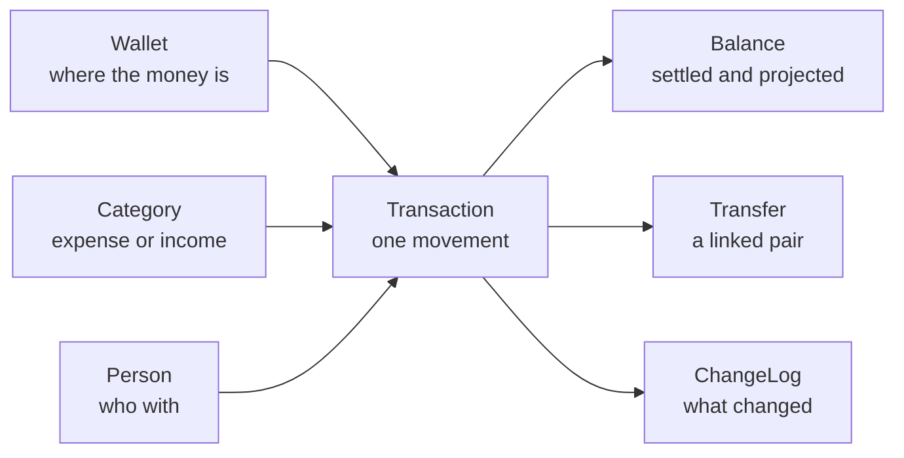

# AGENTS.md — Simple.Finance WebApi

Guidance for AI agents **using this API** to run someone's personal finances on their behalf.
For how the service is built, see the repository root `AGENTS.md`.

You are handling real money records for one person. Nothing here is reversible by an administrator:
there is no delete, no undo and no support desk. Prefer asking the user over guessing, and prefer
adding a correcting record over rewriting history.

## The mental model



- **Wallet** — a place money sits: checking account, savings, cash, a card, a broker.
  It owns a `baseCurrency`, and every balance is expressed in it.
- **Category** — what the money is *for*, and the single source of truth for the **sign**.
  `isExpense: true` makes values negative, `false` makes them positive.
- **Person** — the counterparty: employer, landlord, market, a friend. Optional.
- **Transaction** — one movement, carrying two dates and two values (see *The three dates*).
- **Transfer** — money moving between two wallets. It is **two linked transactions**, never one.

## Getting in

1. `POST /api/account` (anonymous) → returns a **Key** (GUID). It is shown **once** and cannot be
   recovered. Whoever holds it has full access to that person's finances. Store it before doing
   anything else.
2. Send it on every other call: header **`X-Api-Key: <guid>`**.
3. The finance database is created lazily, on the first call that touches finance data.
   `GET /api/account/database` reports the file, its size and the last backup.

One account = one isolated SQLite database. Accounts cannot see each other. Anything that is not
`/api/hello` or `POST /api/account` answers `401` without a valid Key.

## Money rules you cannot fight

The library validates by throwing, and the API turns that into `400` carrying the original message.
Do not work around these — they are the guardrails that keep the data sane.

- **Send positive amounts.** The sign is forced from the category (`isExpense`). Sending `150` or
  `-150` on an expense category both store `-150`. With `categoryId: 0` your sign is kept as-is.
- **`dueValue` must not be zero.**
- **`paymentCurrency` must equal the wallet's `baseCurrency`** (send it empty to inherit).
- **Balances never cross currencies.** Each wallet reports in its own currency and the API never
  sums two of them. If the person has BRL and USD wallets there is no single "total" — say so
  instead of adding numbers that do not add.
- **A category's `isExpense` can never change** after creation. Create a new category instead.
- **Nothing is ever deleted.** `isDeleted` is a flag on wallets, categories and people; no endpoint
  filters by it, so *you* decide whether to show them. Transactions cannot even be flagged — to
  undo one, see *Cancelling something*.
- **Nothing is deduplicated.** Posting the same expense twice creates two expenses.

## The three dates — this is the whole model

Every transaction carries:

| Field | Meaning |
|---|---|
| `dueDate` + `dueValue` | what is **owed**, and when. The plan |
| `paymentDate` + `paidValue` | what was **actually paid**, and when. The cash |
| `status` | `Unpaid`, `Paid` or `Reversed` |

`paidValue` may differ from `dueValue` — that is how you record interest, a discount or a partial
payment. Settled balances always use `paidValue`.

Two derived fields come back on every read:

- `effectiveDate` = `paymentDate` when paid, otherwise `dueDate` **truncated to midnight**.
- `effectiveValue` = `paidValue` when paid, otherwise `dueValue`.

When searching, `dateType` picks which date rules the query:

| `dateType` | Rows returned |
|---|---|
| `DueDate` | anything whose `dueDate` is in the window, **any status** — the bills view |
| `PaymentDate` | only `Paid` rows whose `paymentDate` is in the window — the cash view |
| `EffectiveDate` | paid rows by `paymentDate` **or** non-paid rows by `dueDate` — the timeline view |
| `Created` / `Changed` | when the record was typed or last edited — auditing, not money |

## Balances: exactly what counts

Three endpoints, three different questions. They are **allowed to disagree**, and which one is right
depends on what kind of wallet you are looking at — see *Debit and credit card* right after this.

### `GET /api/wallets/balances` (no `atDate`) — the committed balance

```
Paid rows only, no date filter at all
```

Everything settled, whenever. This is the **home-screen number**: one call, every wallet, and it is
the correct "current" figure for both kinds of wallet. On a debit account nothing is dated forward,
so it equals the settled-now figure below; on a credit card it is the whole committed debt, including
installments that have not been charged yet.

### `GET /api/wallets/{id}/balance` — what has actually cleared

```
Paid rows only, and only paymentDate <= now (UTC)
```

A payment already marked `Paid` but dated next Friday is **not** counted. This is the reconciliation
view: the number to match against a bank statement. On a debit account it is also the answer to
*"how much do I have?"*; on a credit card it is **not** the debt (see below). For this same cut
across every wallet at once, call the endpoint above with `?atDate=<now>`.

### `GET /api/wallets/balances?atDate=D` — the projection

```
+ Paid   rows with paymentDate  <  D      (uses paidValue)
+ Unpaid rows with now < dueDate <= D     (uses dueValue)
```

*"What will be left after everything that falls due until D."* A past `D` gives the historical
settled balance, since the second line is empty by construction.

### Overdue is deliberately out of the projection

A row whose `dueDate` already passed and was never paid is in **neither** line above. This is a
product decision, not an oversight:

> A date that passed with no money moving is treated as an event that **did not happen and is not
> assumed to happen**. The overdue income is presumed not received; the overdue bill is presumed not
> paid, so the cash never left the wallet. The projection is pessimistic on purpose: it never
> credits money the person did not get, and never spends money that is still sitting there.

What this means for you:

- **Never add overdue rows into a projected number.** The projection is the projection; correcting
  it by hand contradicts the product and produces a figure the app itself will never show.
- **Do surface overdue items as their own list**, next to the projection. They are what the person
  must act on — pay it, chase it, or reschedule the `dueDate` so it becomes a future commitment and
  starts being projected again.
- Rescheduling is the *sanctioned* way to bring an overdue item back into the forecast: move
  `dueDate` forward with a `PUT`, and it re-enters the second line.

`Reversed` rows never count, in any of the three endpoints. Wallets with no matching rows report
`0` rather than being omitted.

## Debit and credit card

The three balances only diverge when a wallet holds rows dated **forward**. That is exactly what
separates the two kinds of wallet, and it is why the committed balance is the default view.

### Debit, checking, cash

Nothing is ever dated forward: money moves when it moves, so every `Paid` row sits in the past. The
committed balance and the cleared balance are the same number, and only the projection adds anything
(the bills falling due ahead). There is no decision to make here.

### Credit card

There are three ways to put a credit card into a personal-finance ledger. Two of them corrupt the
reports, and agents reach for them because they are the shortest path. Do not.

| Approach | What breaks |
|---|---|
| Log **only the invoice** as one ordinary bill | Worst of the three. Every purchase collapses into one line: the **category is lost** (it all becomes "credit card") and the **date is lost** — the whole invoice lands on the payment date, so March's shopping is reported in April |
| Split the invoice into a few lines, one per category | Recovers the categories, but the **date is still wrong**: every line still sits on the invoice, not on the day the money was actually committed |
| **Give the card its own wallet** | Correct. Each purchase keeps **its own date and its own category**, so monthly and per-category reports tell the truth. The invoice is then settled with an **internal transfer**, which touches no category and therefore cannot distort any report |

So: a card is **its own wallet**, and it normally sits negative — the balance *is* the debt.

**Each purchase is one transaction on the card wallet, dated when it happened, with its real
category, and `status: "Paid"` from the start.** It is `Paid` because the money is already
committed: the purchase will not un-happen, whatever the invoice does later.

> Recording card purchases as `Unpaid` is the classic mistake. `Unpaid` rows are excluded from the
> committed balance and only surface inside a projection window, so the debt would vanish from the
> home screen and reappear month by month. A purchase is not a plan; it already happened.

**An installment purchase is N transactions**, one per installment, each dated on the month that
installment belongs to — so the later ones carry **future dates and are already `Paid`**. That is the
one place where a wallet legitimately holds rows dated forward, and it is the whole reason the
committed balance exists.

Dates matter more than they look: the date you put on the row is the date the expense shows up in
every report. Putting the invoice's date there instead of the purchase's re-creates, one row at a
time, the very defect of the two wrong approaches above.

With a card holding a 300 purchase in 3 installments, none of them charged yet:

| Question | Endpoint | Answer |
|---|---|---|
| What do I owe on this card? | committed (`/balances`) | **−300** — the whole debt |
| What has already been charged? | cleared (`/{id}/balance`) | 0 — no installment reached its date yet |
| How much of it lands by day D? | projection (`?atDate=D`) | −200 at +40d, the two first installments |

Read the middle row again: the cleared balance reports **zero debt** on a card with three
installments contracted. Never quote it as the card's balance.

**Card limit.** The API does not store it and will not — the person already knows their limit, and a
field nobody can validate only goes stale. If they tell you the limit, the arithmetic is
`available = limit + balance` using the **committed** balance, because both are totals with no date
attached. With the card above and a limit of 1000, that is `1000 + (−300) = 700`.

**Paying the invoice is an internal transfer with no category**: `POST /api/transfers`, checking as
source, card as destination, and **`sourceCategoryId: 0` and `destinationCategoryId: 0`**. The
negative leg leaves the checking account, the positive leg offsets the card, and because neither leg
carries a category, the pair is invisible to every per-category report. That is the point: the
expense was already categorised when the purchase was recorded, so giving the payment a category
would count the same money twice — once as "electronics", again as "credit card bill" — and would
inflate income on the receiving side too. The library agrees with this: a transfer with no category
is reported as *"Internal Transfer"*.

A card only reaches zero when no future installment is left. That is correct, not a bug: what remains
is debt already contracted.

**Reading one invoice**: search the card wallet over the period the invoice covers (its closing
window, not its due date) — `GET /api/transactions?dateType=PaymentDate&start=…&end=…&kind=Wallet&id=<cardWalletId>`
— and sum `paidValue`. That total is what the transfer should carry.

## Recipes

### First-time setup

1. Create the wallets (`POST /api/wallets`) with the right `baseCurrency`.
2. Create categories (`POST /api/categories`) in pairs of intent: expenses (`isExpense: true`) and
   income (`isExpense: false`). For transfers, one of each (e.g. "Transfer out" / "Transfer in").
3. People are optional; create them when the person cares about *who*.

### Record something already paid

`POST /api/transactions` with `status: "Paid"`, the same date on `dueDate` and `paymentDate`, and the
same amount on `dueValue` and `paidValue`.

### Record a card purchase

Same call, on the card's **own wallet**, with the purchase's real date and real category, and
`status: "Paid"` — one call per installment, each dated on the month it belongs to. Settle the
invoice later with a **category-less** transfer. See *Debit and credit card* for why all three of
those matter.

### Record a bill to pay later, then settle it

1. `POST /api/transactions` with `status: "Unpaid"`, the real `dueDate`, `dueValue` set, `paidValue: 0`.
2. When paid: `PUT /api/transactions/{id}` with `status: "Paid"`, the real `paymentDate` and the
   `paidValue` that actually left the wallet (may differ from `dueValue`).

**`PUT` replaces the whole record** — send every field you want to keep. `GET` it first, change what
moved, send it back.

### "Will I make it to the 30th?"

`GET /api/wallets/balances?atDate=<end of the 30th, UTC>`, compared against
`?atDate=<now>`. The difference is everything falling due in between.

Report the overdue list **beside** that number, never merged into it: the projection assumes those
never happen, while the person may well decide to pay them.

### "What is overdue?"

`GET /api/transactions?dateType=DueDate&start=<far past>&end=<now>`, keeping rows with
`status == "Unpaid"`. These are exactly the rows the projection ignores.

### "How much did I spend on groceries this month?"

`GET /api/transactions?dateType=EffectiveDate&start=…&end=…&kind=Category&id=<categoryId>`, summing
`effectiveValue`. Use `kind=Wallet` or `kind=Counterparty` for the other two cuts. `kind` and `id`
must always travel together.

### Move money between wallets

`POST /api/transfers` — never two separate transactions. The source category must be an expense and
the destination category must not be (or send `0` for both). You get both legs back, cross-linked by
`typeOtherId`. Edit the pair with `PUT /api/transfers/{id}` using either leg's id; editing a leg
through `/api/transactions` is rejected with `400`.

### Cancelling something

There is no delete. Set `status: "Reversed"` with `PUT /api/transactions/{id}`: it stops counting in
every balance but **still appears** in `EffectiveDate` and `DueDate` searches, which only exclude
`Paid` rows from their non-paid branch. Filter it out yourself when listing.

### "What changed, and when?"

`GET /api/changelog?start=…&end=…` for a period, or
`GET /api/changelog/{Wallet|Category|Person|Transaction}/{id}` for one record's full history. It is
written automatically and cannot be edited. Each entry is one write with the fields it touched;
`isCreation` marks the row's birth and the literal string `[NL]` means "there was no value".
Timestamps have **second** granularity, so two writes inside the same second collapse into one entry.

### Remembering client settings

`GET /api/account/preferences` lists them; `PUT`/`DELETE /api/account/preferences/{name}` set and
remove one. They live on the management database, beside the account, never inside the finance data.

The name is a single word of up to **50** characters using only `a`-`z`, `0`-`9` and `-` —
`ui-theme`, `report-lastrange`. Anything else is `400`, uppercase and `/` included. The value is free
text up to **512** characters. Those limits exist so a preference stays a setting and does not
quietly become a second database. Writing the same name twice replaces it, it never duplicates.
Removing a name that is not there answers `404`.

**Store loose values, not serialized blobs.** A write replaces the whole value of one name — there is
no partial update — so whatever you pack into a single preference becomes one all-or-nothing unit.
Put a JSON object in there and every change turns into read, edit in memory, write it all back: two
agents touching two unrelated settings in the same blob will silently overwrite each other, the last
one wins, and `DELETE` can only drop the entire set. Keep one name per setting — `ui-theme`,
`ui-density`, `report-lastrange` — and those writes never collide, because the uniqueness is per name.

Compose several values into one preference only when they are genuinely correlated, that is, when a
partial update would leave an inconsistent state and replacing them together is the *correct*
behaviour — a grid's column layout, a saved filter. Then the blob is not a shortcut, it is the unit
of change. Watch the 512 characters: a value that grows with the data will start answering `400` one
day, in the middle of someone's evening.

## Traps, in one place

- Never quote `/api/wallets/{id}/balance` as a credit card's balance: it reports 0 for a card whose
  installments have not been charged yet. The committed balance is the card's debt.
- Card purchases go in as `Paid`, dated when they happened, one row per installment. `Unpaid` hides
  the debt, and the invoice's date in place of the purchase's puts the expense in the wrong month.
- The invoice payment is a transfer with **no category on either leg** — a categorised one double
  counts the expense and inflates income.
- A running total seeded at zero is a **Net**, not a Balance, and it only means something inside a
  single currency. Only a total seeded with `?atDate=<start>` of one wallet is a Balance.
- A ledger's running total counts overdue rows; the projection does not. They disagree on purpose.
- The projection excludes overdue rows **by design**. Query them separately; never fold them in.
- `Reversed` rows vanish from balances but stay in searches.
- `PUT` is a full replacement, not a patch. Fields this API does not expose (`ReferenceCurrency`,
  `RC_*`, `ExternalIdentifier`) are reset by it — never point this service at a database written by
  the desktop app.
- Send dates in **UTC** (`...Z`). Everything stored and returned is UTC, so "today" for a balance is
  the UTC day, which can differ from the person's local day near midnight.
- No pagination: a wide date range returns everything at once.
- A preference write replaces the whole value of that name. One setting per name — a serialized blob
  turns every edit into read-modify-write, and concurrent edits of unrelated settings clobber each other.
- Creating an account is cheap and irreversible — there is no way to list or delete accounts.

## Errors

| Code | Meaning |
|---|---|
| `400` | your data broke a rule. `detail` carries the library's own message — read it, it is precise |
| `401` | missing, malformed, unknown or disabled Key |
| `404` | the id does not exist, or is not a transfer when asked as one |
| `501` | `Type = Special`, not implemented by the library |

An empty history or an empty search is `200` with an empty list, never `404`.

## Endpoint reference

| Method + path | Purpose |
|---|---|
| `GET /api/hello` | liveness, no Key |
| `POST /api/account` | create account, returns the Key once, no Key |
| `GET /api/account` | the account behind the Key |
| `GET /api/account/database` | file, size, last backup |
| `GET /api/account/preferences` | every preference of the account |
| `PUT`/`DELETE /api/account/preferences/{name}` | set or remove one preference |
| `GET`/`POST /api/wallets`, `GET`/`PUT /api/wallets/{id}` | wallets |
| `GET /api/wallets/balances` | committed balance of every wallet — the home-screen number |
| `GET /api/wallets/balances?atDate=D` | projection: settled up to D plus what falls due until D |
| `GET /api/wallets/{id}/balance` | what has actually cleared, for reconciliation |
| `GET`/`POST /api/categories`, `GET`/`PUT /api/categories/{id}` | categories |
| `GET`/`POST /api/persons`, `GET`/`PUT /api/persons/{id}` | counterparties |
| `GET /api/transactions?dateType=&start=&end=[&kind=&id=]` | search |
| `GET`/`POST /api/transactions`, `PUT /api/transactions/{id}` | transactions |
| `POST /api/transfers`, `GET`/`PUT /api/transfers/{id}` | transfers, always as a pair |
| `GET /api/changelog?start=&end=[&externalId=]` | audit trail for a period |
| `GET /api/changelog/{table}/{id}` | audit trail of one record |

Not exposed on purpose: currency conversion, statement import/export (OFX, MT940, CNAB, CSV) and
change notifications. If the person needs those, they live in the `Simple.Finance` library itself,
not here.
